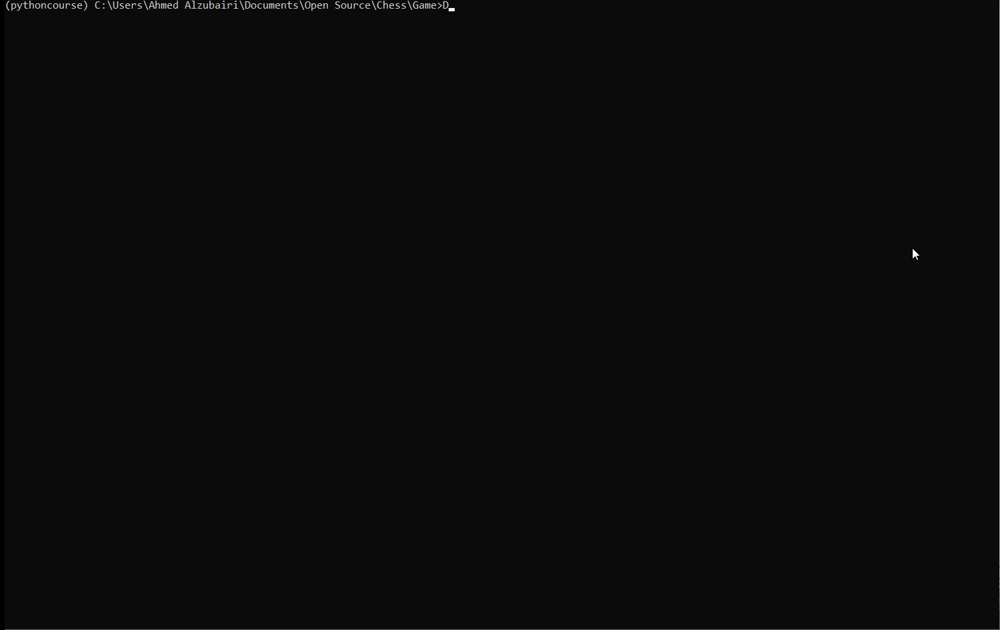

# Chess

[](https://travis-ci.org/AhmedAlzubairi1/Chess)
[](https://codecov.io/gh/AhmedAlzubairi1/Chess)
[](https://chess1.readthedocs.io/en/latest/?badge=latest)

Personal Website:
https://ahmedalzubairi1.github.io/ahmedalzubairi.github.io/

# COMS4995 Project -> Chess Backend

This is a chess backend repo that you can use for your front end chess implementation. The code handles everything about the the game, such as the rules, captures, movements, ect. All you have to do is handle the display. By default, the repo has a terminal front end that you can interact with. Here is a demo of how the game looks like using the terminal front end: 



## Installation
There isn't any package manager to install the repo. The way to install the repo is to just fork/clone it. 


## Running the Game

To run the sample terminal front end of the game do : 

```
cd Game
python gameRunner.py
```

## Features
- Creates a Chess Board
- Has all Chess Pieces
- Ability to move pieces
- Ability to capture pieces
- Castling 
- Pawn Passant capture
- Checks
- Check Mates

## Documentation
- [Read the Docs](https://chess1.readthedocs.io/en/latest/) is where you will find a detailed explanation of what each method/function does


## How to Use Code for Your Chess Front End

If you look at the gameRunner.py method, you notice that it runs  the Game.py's startGame() method. This is the method that creates my terminal implementation. 

To use the code as a backend for your chess front end implementation, you will use the Game.py class, but would need to replicate the startGame() method logic to work for your frontend. This isn't a complicated task because everything is handled and the logic for startGame() isn't complicated to do replicate. The reason I have the startGame() method is to demonstrate a terminal based front end implementation. 

Below are the logic steps you need to do for your front end implemntation. This logic is copied directly from the Game.py startGame() method. See logic below: 

1. The first thing to do is have some logic to get the user to start the game. This is optional. In my startGame() implementation I don't give this option and run the game right away as soon as the user runs the program.
2. Run the self.updateCheckBoard(self.playerOneTurn) to update the check board. The check board is a secondary board that displays all possible captures from the opposite player. self.playerOneTurn is true if it is player one's turn and false if it is player two's turn
3. Run self.isCheckMate(self.playerOneTurn) next. This tells you if the current player has lost or not. You decide on what you want to do with that information.
4. If the user hasn't lost via checkmate, check if the user is in check mate by running self.isCheck(self.playerOneTurn). You should probably notify the user that they are in check if the method returns true. In my implementation I do this by doing print statements.
5. Now run the following code. This code is needed just in case the user can do a pawn passant move. 
```
if self.playerOneTurn:
    self.playerOnePassantPawns = set()
else:
    self.playerTwoPassantPawns = set()
```
6. After this is done, this is when your implementation comes to play. You decide how to display the board. As for the backend portion, the board's state can be seen in the self.board 2d list. 
7. You can then implement your own way of getting a move from the user. In my implementation, I use the input() method. After you decide on how to get the input for a move, you need to reference the location of the piece desired by the user. The piece would be located somewhere in the 2d list (self.board).
- Call the move method on that piece. The first parameter of that method is a number between 1 to 8 representing one of the rows of a chess board. The second parameter needs to be a letter from A to H representing the column of the chess board. It needs to be a capalized letter, not lower cased. 
  - For example, lets say the piece requested to move is located at self.board[0][0] and you want it to move to position 2A. You would do this by executing this code:
  ```
  self.board[0][0].move(2,"A")
  ```
8. if the user wanted to make a king side castle or a queen side castle special move, you would need to call either the self.attemptKingCastle(self.playerOneTurn) or the self.attemptQueenCastle(self.playerOneTurn) where the input parameter is true for player one and false for player two.
9. After the move has been made, you need to change the boolean value of self.playerOneTurn with the opposite value. So turn it to true if it is false and turn it false if it is true. 

10. That is the end of the implementation. You can now then go back to step 1. In my terminal implementation I simply did a while true to repeat steps 1 to 9.


